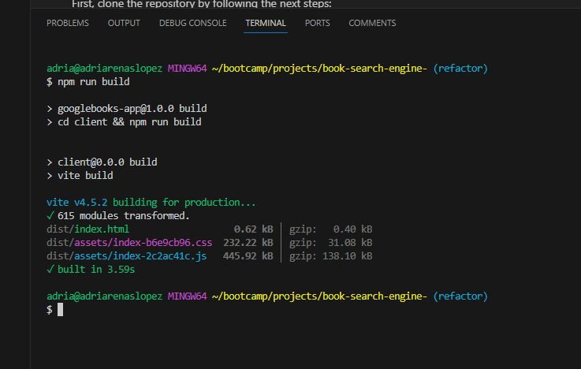
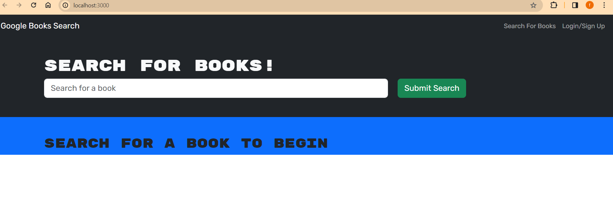

# book-search-engine-

<h1 align= "center" id="title">MERN-Book-Search-Engine
</h1>

 

 

<h1>👩‍💻 About </h1>

The current app has been created with the intention of  practicing graphql and apollo server implementation in conjuction with mongoDB, while still using the library of react, which was introduced recently. The objective was acomplished by refactoring the book search engine application provided by the bootcamp, turning it from a RESTful API into  GraphQL API built with Apollo Server.

The application will allow the user important functionality as signup, login, search for a favorite book thanks to an extensive third party API data, save the book to a favorite section, and delete them based on the user criteria.

    NOTE: please be advised that my main job was to refactor the application to implement the new conceps taught in the bootcamp

----------------------

  
 📊 Table of Contents 

  <ol>
    <li>
      <a href="#about">About The Project</a>
        <li><a  href="#built-with">Built With</a></li>
    </li>
    <li><a  href="#Installation">Installation</a></li>
    <li><a  href="#contributing">Contributing and Contact</a></li>
    <li><a  href="#ack">Acknowledgments</a></li>
    <li><a  href="#license" >License</a></li>
  </ol>

---------

<h1>💲Built With </h1>

* 

* 

* 

* 

* 

* 

* 

* 

---------------------------------

<h1>🚀 Installation </h1>

💿 live demo link:   https://florezf90searchengine.onrender.com/

To use this app in a local envirioment, please follow these steps:

First, clone the  repository by following the next steps:

      git clone https://github.com/florezf90/book-search-engine-.git

2.Second, initialize the node packages by running:

        npm i

NOTE: this will initialize all the packages for the server, client and root directories

3.third, please build the application by running :

     npm run build

      
Once done, your command line should look like this:

4.Launch the app by running:

     npm run develop

once done, it is going to take you automatically to the browser in development envirioment:

 

 

 -----------------------------

-------- 

 

<h1>📱 Contributing</h1>

    
If you have a suggestion that would make this project better, don't hesitate to reach out and create an issue with the tag "enhancement". Don't forget to give the project a star! Thanks again!

If you have any questions, reach to:

 ✉️ mail: florezf90@gmail.com 
 

----------------

  

<h1>🏆 Acknowledgments </h1>

*   

         Note: please refer to the 'Built it section' for more information about the docs on the technologies used in the project.   
  
-----

  

<h1>🔒🔑 License </h1>

 
 

## [🔝](#title)